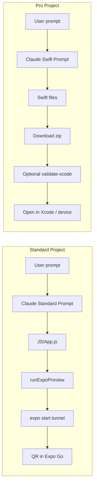

# Expo Go vs Xcode: When Each Is Best for the User

## How the Two Paths Work

Vibetree has two project types, selected in the editor (and stored in `localStorage` as `vibetree-project-type`):

| Aspect | **Standard (Expo Go)** | **Pro (Xcode)** |
|--------|------------------------|-----------------|
| **Stack** | React Native + Expo (JavaScript/JSX) | Swift + SwiftUI (native iOS) |
| **System prompt** | `SYSTEM_PROMPT_STANDARD` in `src/lib/llm/claudeAdapter.ts` | `SYSTEM_PROMPT_SWIFT` in `src/lib/llm/claudeAdapter.ts` |
| **Output files** | `.js` (e.g. `App.js`) — single entry at project root | `.swift` (e.g. `App.swift`, `ContentView.swift`, `Models/`, `Views/`) |
| **Run on device** | `src/app/api/projects/[id]/run-on-device/route.ts` calls `src/lib/expoPreview.ts`: writes files to `.expo-preview/{projectId}`, `npm install`, `npx expo start --tunnel`, returns URL for QR code | Returns `projectType: "pro"` and no Expo URL; user uses "Download for Xcode" and optionally "Validate build on Mac" (xcodebuild) |
| **Preview** | `src/components/editor/PreviewPane.tsx` shows QR code when `expoUrl` is set; user scans with Expo Go app | PreviewPane shows "Download source" CTA; no in-browser preview of the native app |
| **Validation** | None (no compile step in pipeline) | Optional: validate-xcode → Mac runner runs xcodebuild; auto-fix loop up to 5 attempts |
| **Export** | `src/app/api/projects/[id]/export/route.ts` returns all stored files | Export filters to `.swift` only; `src/app/api/projects/[id]/export-xcode/route.ts` produces a zip with Xcode project (`.xcodeproj` + Swift files) |

So: **Expo Go = React Native only; Xcode = SwiftUI only.** They are mutually exclusive per project. The agent does not choose at runtime — the user chooses the project type (standard vs pro) before or when building; the same chat then generates either JS or Swift accordingly.

---

## Expo Go (Standard) — Pros and Cons

### Pros

- **Instant try on device:** User gets a QR code; scan with Expo Go and the app loads. No Xcode, no Mac build, no signing.
- **Works on any machine:** No need for a Mac to run the app. Server runs `expo start --tunnel`; user only needs Expo Go on their phone and a browser.
- **No compilation step:** No xcodebuild, so no "build failed" or auto-fix loop. If the JS is valid and the Expo runtime accepts it, it runs.
- **Faster iteration:** No wait for Mac runner or validation. Good for quick UI experiments and demos.
- **Single codebase for mobile:** React Native can (in other setups) target Android too; in Vibetree the template is Expo Go (iOS-focused), but the stack is the same ecosystem.
- **Easier for non-iOS devs:** No Apple IDs, provisioning, or Xcode. Lower friction for learners and non-Mac users.

### Cons

- **Not native:** It's a JS bundle running in Expo Go (React Native bridge). Performance and system integration are not the same as a native Swift app.
- **Expo Go sandbox:** Only APIs supported in Expo Go; no custom native modules, no full native UI. If the user wants something that needs native code, they hit a wall.
- **No App Store path from here:** To ship a standalone app you'd need to eject or use EAS Build (not in current Vibetree flow). The "Run on device" path is preview-only.
- **No build-time quality gate:** There's no compiler or linter in the pipeline. Syntax/runtime errors show up only when the user opens the app in Expo Go.
- **Tunnel and server load:** `expo start --tunnel` uses a tunnel (e.g. ngrok); can be slow or flaky and depends on server and network.
- **One preview per project:** `src/lib/expoPreview.ts` writes to `.expo-preview/{projectId}` and starts one process per project; multiple concurrent previews could conflict or exhaust resources.

---

## Xcode (Pro) — Pros and Cons

### Pros

- **Native iOS app:** Real Swift/SwiftUI; best performance and access to full iOS APIs, system look and feel, and platform conventions.
- **Path to App Store:** The exported project can be archived and submitted. User owns the source and the Xcode project.
- **Build validation:** Optional "Validate build on Mac" runs xcodebuild and an auto-fix loop, so many compile errors are fixed before the user downloads. Build results are logged for improvement (see `QUALITY_IMPROVEMENT_PLAN.md`).
- **No tunnel:** User downloads a zip and runs locally in Xcode. No dependency on Vibetree server for actually running the app after download.
- **Offline after download:** Once the user has the zip, they can build and run on device/simulator without the editor.
- **Best for "real" apps:** Polished, native UX; suitable for portfolio pieces, prototypes for stakeholders, or apps you intend to ship.

### Cons

- **Requires a Mac and Xcode:** To run on device or simulator, the user must have a Mac with Xcode. No way around it for native iOS.
- **Friction to try:** User must download zip, unzip, open in Xcode, maybe set team/signing, then run. Slower than scanning a QR code.
- **Compilation can fail:** Swift is strict; the LLM can produce code that doesn't compile. Auto-fix improves this but doesn't guarantee success. Failed builds are visible in the Build Results dashboard.
- **Validation depends on Mac runner:** If no runner is connected or the runner is busy, "Validate build on Mac" waits or fails. Runner must have Xcode and a healthy environment.
- **No in-editor preview:** PreviewPane doesn't run the Swift app; it only shows the "Download source" CTA. User can't "see" the app without opening it in Xcode/simulator.

---

## When Each Is Best for the User

| User goal | Prefer |
|-----------|--------|
| **"I want to see it on my phone in 30 seconds"** | Expo Go — QR scan, no Mac required. |
| **"I don't have a Mac"** | Expo Go only (Xcode path is not an option). |
| **"I want a real iOS app I can ship or show in portfolio"** | Pro (Xcode) — native, exportable, submittable. |
| **"I care about performance and native feel"** | Pro (Xcode). |
| **"I'm learning; I want quick feedback"** | Expo Go — faster loop, fewer steps. |
| **"I want to know it compiles before I open Xcode"** | Pro with "Validate build on Mac" (and optional Build Results review). |
| **"I need an API or capability that's only in native iOS"** | Pro (Swift/SwiftUI). |
| **"I want to avoid dealing with signing / Xcode"** | Expo Go. |
| **"I want to iterate on design with the agent and keep testing on device"** | Expo Go for speed; Pro if they're okay with download/run each time and value native quality. |

---

## Summary Table

| Criteria | Expo Go (Standard) | Xcode (Pro) |
|----------|--------------------|-------------|
| **Tech** | React Native (JS) | Swift/SwiftUI |
| **Run on device** | Scan QR in Expo Go | Download zip → open in Xcode → run |
| **Need a Mac** | No | Yes (to run/ship) |
| **Build validation in pipeline** | No | Yes (optional xcodebuild + auto-fix) |
| **Time to first run** | Short (tunnel + scan) | Longer (download, unzip, Xcode, run) |
| **App Store / standalone app** | No (preview only) | Yes (full Xcode project) |
| **Performance / native APIs** | Good for demos; limited by Expo Go | Native |
| **Best for** | Quick previews, non-Mac users, learning | Shipping, portfolio, native quality, compile assurance |

---

## Implementation Note

The choice is **project-type level**, not per-message. The editor stores `vibetree-project-type` and the message/stream API uses it to select the system prompt and to decide whether to run Pro build completion (e.g. `src/components/editor/useChat.ts` `isProBuild` and `onProBuildComplete`). So when the agent builds an app, the only decision point is which project type the user (or default) has set; the agent doesn't switch between Expo and Xcode mid-conversation.
